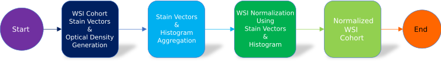

Robust Image Population-based Stain Normalization: How Many Reference Images Are Enough to
Normalize?

 

## Contents

- [Image Population Based Histological Normalization](#submission-or-project-name)
  - [Description](#short-description)
    - [What's the problem?](#whats-the-problem)
    - [How can technology help?](#how-can-technology-help)
  - [Installation](#Installation)
  - [Getting started](#getting-started)
  - [Authors](#authors)
  - [License](#license)
  - [Acknowledgments](#acknowledgments)

## Description

### What's the problem?

Variation in materials, equipment, and staining protocols, make tissue slide staining rife with color aberrations. Although, pathologists train to compensate for slide color variations, the color disparity introduces inaccuracies in automated computational analysis, hindering algorithmic generalizability and accentuating data domain shift, hence highlighting the need for stain color normalization. Histopathology, more specifically whole slide image (WSI) digital pathology, lacks the color reference standards of other medical imaging domains. Digital pathology state-of-the-art WSI stain normalization methods employ a single WSI as the reference standard for cohort stain color normalization. Moreover, selecting a WSI representative of a WSI cohort is challenging, progressively for large cohort staining variations and image sizes, inadvertently introducing a color normalization bias.

### How can technology help?

The aggregation of a whole slide image (WSI) cohort subset is representative of an entire WSI cohort as a result of the law of large numbers theorem and shown as a power law distribution. This tool calculates the stain vectors and histogram for a given WSI cohort subset and normalizes a given WSI using Vahadane's structure-preserving color normalization algorithm

## Installation

1. Execute installation [Conda packages](./Installation_Bash_Files/Conda_Packages_Install.sh) bash file

2. Execute installation [Python packages](./Installation_Bash_Files/Python_Packages_Install.sh) bash file 

   Note: See a full list of CBICA python conda base environment [packages and respective versions](./Installation_Bash_Files/CBICA_Cluster_Package_Versions.txt) 

## Project roadmap

The project provides the following features:

- Calculates the stain vectors and histogram for a given image
- Aggregates the stain vectors and histogram for a given set of images
- Normalizes a given image using the aggregated stain vectors and histogram using [Vahadane's](https://ieeexplore.ieee.org/stamp/stamp.jsp?arnumber=7460968) algorithm

## Getting started

1. Compute stain vectors and pixel optical density for each of the images in the given WSI cohort using this [dataframes generator](./Python_Scripts/Produce_Image_Stain_Vectors_and_Optical_Density.py) python script. Note, calculated stain vectors and optical density will be stored in dataframes. See switch description below.

   | Switch                       | Description                                                  |
   | ---------------------------- | ------------------------------------------------------------ |
   | --Slide_Image                | Image of interest (jpg)                                      |
   | --Label_Map_Image            | Image map of image of interest (png)                         |
   | --Gray_Level_To_Label_Legend | Gray level color legend (csv file)                           |
   | --Output_Dataframe_File      | Output pandas dataframe file name (parquet)                  |
   | --Excluding_Labels           | Small or dubious labels in the label map image to ignore (text) |

   

2. Compute normalizing stain vectors and histogram aggregates using python [Aggregate_Stain_Vectors_and_Histograms](/Python_Scripts/Aggregate_Stain_Vectors_and_Histograms.py) script. See switch description below.

   | Switch                             | Description                                             |
   | ---------------------------------- | ------------------------------------------------------- |
   | --Histogram_Dataframe_Directory    | Sum and normalized to 10,000 count histogram  (parquet) |
   | --Stain_Vector_Dataframe_Directory | Percent Area Stain Vector (parquet)                     |
   | --Output_Directory                 | Aggregated histogram and stain vectors  (parquet)       |
   | --Number_of_Images                 | Number of random images                                 |

   ​                              

3. Normalize image using normalizing stain vectors and histogram aggregates utilizing python [Normalize_Image](/Python_Scripts/Normalize_Image.py) script. See switch description below.

   | Switch                      | Description                        |
   | --------------------------- | ---------------------------------- |
   | --Image_To_Normalize        | Image of interest (jpg)            |
   | --Normalizing_Histogram     | Normalizing Histogram (numpy)      |
   | --Normalizing_Stain_Vectors | Normalizing Stain Vector (numpy)   |
   | --Output_Directory          | Normalized Image of interest (png) |
   
      

## Authors

## License

This project is licensed under the Apache 2 License - see the [LICENSE](LICENSE) file for details.

## Acknowledgments

- Special thanks to Robert S. Pozos PhD, for his invaluable feedback
